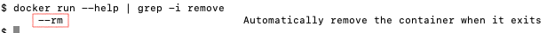
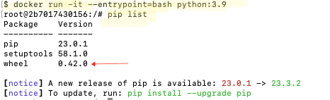

## Module 1 Homework (My Answers)

### Question 1 : 

--rm

```
docker run --help | grep -i remove
```



### Question 2: 
- 0.42.0

This docker command runs the python:3.9 image, with a bash terminal
```
docker run -it --entrypoint=bash python:3.9
```

then look at the packages in pip, as with any other dev environment
```
pip list
```




### Question 3:
- 15612


For full python code, see  `pg_data_ingestion.py`

SQL Query:
```
SELECT COUNT(*) AS num_taxi_trips
FROM public.green_taxi_data_t2 
WHERE CAST(lpep_pickup_datetime AS DATE) = '2019-09-18'
AND CAST(lpep_dropoff_datetime AS DATE) = '2019-09-18';
```
CLI Output
```commandline
Running query for question #3...
   num_taxi_trips
0           15612
```

### Question 4. Largest trip for each day

- 2019-09-26

For full python code, see  `pg_data_ingestion.py`

SQL Query:
```
SELECT CAST(lpep_pickup_datetime AS DATE) AS pickup_day,
       MAX(trip_distance) AS max_daily_trip_distance
FROM public.green_taxi_data_t2 
WHERE CAST(lpep_pickup_datetime AS DATE) IN ('2019-09-18', '2019-09-16', '2019-09-26', '2019-09-21')
GROUP BY pickup_day
ORDER BY 2 DESC
LIMIT 1;
```
CLI Output
```commandline
Running query for question #4...
   pickup_day  max_daily_trip_distance
0  2019-09-26                   341.64
```

### Question 5. Three biggest pick up Boroughs

- "Brooklyn" "Manhattan" "Queens"


For full python code, see  `pg_data_ingestion.py`

SQL Query:
```
 SELECT "Borough" AS borough, 
         SUM(total_amount) AS daily_total_amount
   FROM green_taxi_data_t2 AS taxi
  INNER JOIN borough_map AS mp -- join to map table to get the pick up borough from location id
     ON taxi."PULocationID" = mp."LocationID"
  WHERE CAST(lpep_pickup_datetime AS DATE) = ('2019-09-18')
    AND mp."LocationID" < 264 -- ignore unknown borough
  GROUP BY borough -- want top boroughs
  HAVING SUM(total_amount) > 50000 -- want sum of total_amount superior to 50k
  ORDER BY 2 DESC;
```

CLI Output
```commandline
Running query for question #5...
     borough  daily_total_amount
0   Brooklyn            96333.24
1  Manhattan            92271.30
2     Queens            78671.71
```

### Question 6. Largest tip


- JFK Airport

For full python code, see  `pg_data_ingestion.py`

SQL Query:
```
 SELECT mdo."Zone", tip_amount
   FROM green_taxi_data_t2 AS taxi
  INNER JOIN borough_map AS mpu -- join to map table to get the pick up zone from location id
     ON taxi."PULocationID" = mpu."LocationID"
  INNER JOIN borough_map AS mdo -- join to map table to get the drop off zone from location id
     ON taxi."DOLocationID" = mdo."LocationID"
  WHERE CAST(lpep_pickup_datetime AS DATE) BETWEEN '2019-09-01' AND '2019-09-30' -- in Sept 2019
    AND mpu."Zone" = 'Astoria' -- picked up in Zone Astoria
  ORDER BY 2 DESC
  LIMIT 1;
```
CLI Output
```commandline
Running query for question #6...
          Zone  tip_amount
0  JFK Airport       62.31
```


### Question 7. Creating Resources

See homework submission form for full output since it has gcp project info.


## Submitting the solutions

* Form for submitting: https://courses.datatalks.club/de-zoomcamp-2024/homework/hw01
* You can submit your homework multiple times. In this case, only the last submission will be used. 

Deadline: 29 January, 23:00 CET
